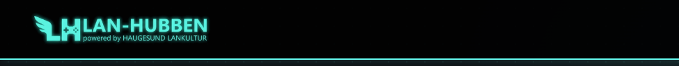

<p align="center">
  
</p>

<p align="center">
  
</p>

# Lanhubben Signage – Android TV-app

**Lanhubben Signage er en app for Android TV som gjør det enkelt å vise innhold fra [lanhubben.no](https://www.lanhubben.no) på Chromecast med Google TV, Google TV og andre Android TV-er.**

Appen åpner Lanhubbens digital signage-spiller i fullskjerm, uten innlogging eller oppsett på selve TV-en. Skjermen kobles til Lanhubben med en kode som vises på skjermen.

## Funksjoner

- Fullskjerm uten menyer, og skjermen holdes våken mens appen kjører
- Video og lyd starter automatisk
- Prøver på nytt hvert 10. sekund hvis nettverket faller ut
- Skjermrotasjon (0°/90°/180°/270°) for TV-er i stående format. Valget vises første gang appen startes, og huskes
- Meny med «Last siden på nytt», «Endre skjermrotasjon» og «Avslutt appen»
- Dukker opp i Android TV-launcheren, og forsøker å starte ved oppstart av enheten

## Bruk

Åpne menyen med **OK/Select**, piltastene, **Tilbake**, **Meny** eller langt trykk på berøringsskjerm. Det finnes også et ekstra ikon, «Lanhubben Innstillinger», i launcheren. **Play/Pause** laster siden på nytt.

## Installere

Last ned nyeste `lanhubben-signage-*.apk` fra [Releases](../../releases/latest) og installer på enheten som beskrevet under. Endringer er listet i [CHANGELOG.md](CHANGELOG.md).

### Installere på Chromecast / Android TV med trådløs adb

Dette fungerer også på Chromecast uten porter. PC-en og TV-en må være på samme nettverk.

**1. Slå på utviklermodus på TV-en**

1. Innstillinger → System → Om → trykk på «Android TV OS build» 7 ganger.
2. Innstillinger → System → Utviklermuligheter → slå på **USB-feilsøking** / **Trådløs feilsøking**.
3. Finn IP-adressen: Innstillinger → Nettverk og Internett → din tilkobling.

**2. Installer adb (Android Platform Tools) på maskinen din**

<details open>
<summary><b>Windows</b></summary>

```powershell
winget install Google.PlatformTools
```

Åpne deretter et nytt PowerShell-vindu. Alternativt kan du laste ned [Platform Tools](https://developer.android.com/tools/releases/platform-tools) og pakke ut zip-filen.

```powershell
adb connect 192.168.1.50:5555
adb install -r .\lanhubben-signage-v1.0.apk
```
</details>

<details>
<summary><b>macOS</b></summary>

```bash
brew install android-platform-tools
adb connect 192.168.1.50:5555
adb install -r ./lanhubben-signage-v1.0.apk
```
</details>

<details>
<summary><b>Linux</b></summary>

```bash
# Debian/Ubuntu
sudo apt install adb
# Fedora
sudo dnf install android-tools
# Arch
sudo pacman -S android-tools

adb connect 192.168.1.50:5555
adb install -r ./lanhubben-signage-v1.0.apk
```
</details>

Bytt ut `192.168.1.50` med IP-adressen til TV-en. Godkjenn «Tillat feilsøking» på TV-en første gang. Hvis TV-en viser en annen port under «Trådløs feilsøking», bruk den i stedet for 5555.

Appen finner du under «Apper» på TV-en. Du kan koble fra med `adb disconnect`.

**Alternativ uten PC:** installer «Downloader» fra Play Store på TV-en, tillat «Installer ukjente apper» for den, og skriv inn nettadressen til APK-en.

## Hindre sleep og skjermsparer

Appen holder skjermen våken, men Android TV har egne innstillinger som kan overstyre det. På hver enhet:

- Innstillinger → System → Ambient mode / Skjermsparer: **Av**
- Innstillinger → System → Strøm og energi: «Slå av skjermen automatisk» og «Slå av enheten automatisk» til **Aldri**
- Slå av HDMI-CEC «auto power off» hvis TV-en skrur seg av

## Bygge selv

Krever JDK 17 og Android SDK (sett `ANDROID_HOME`, eller `sdk.dir` i `local.properties`).

```bash
./gradlew assembleDebug     # app/build/outputs/apk/debug/
./gradlew assembleRelease   # app/build/outputs/apk/release/
```

Release-bygget er signert med debug-nøkkelen til det er satt opp en egen signeringsnøkkel. URL-en som vises endres i `app/build.gradle.kts` (`PLAYER_URL`). Tekst og grafikk til Google Play ligger i [`store/`](store/).

## Lisens og varemerker

Lanhubben-navnet og logoen tilhører Haugesund Lankultur.